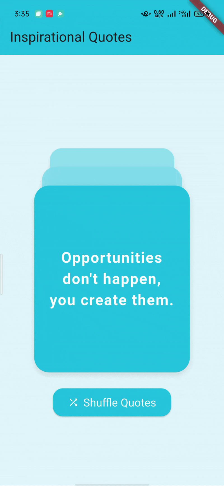
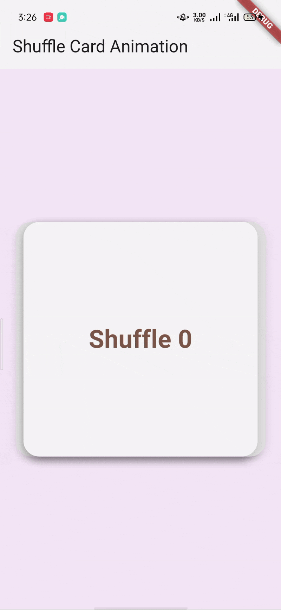
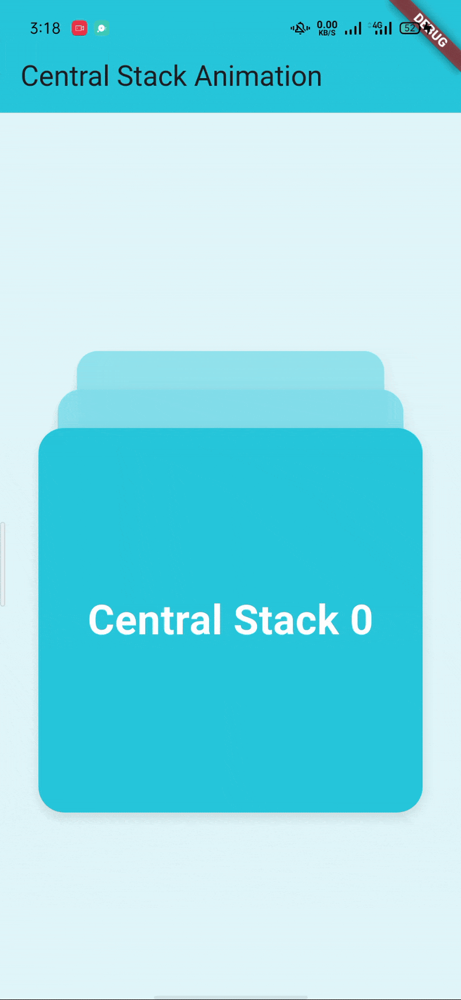
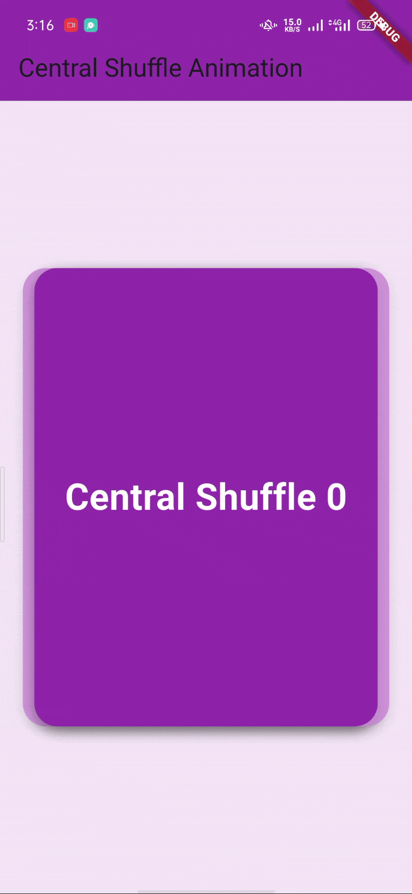

# Swipe Cards Package

The **Swipe Cards** package provides customizable card animations for Flutter applications. It includes two types of animations: **Shuffle Card Animation** and **Stack Card Animation**. This package allows developers to easily integrate card swiping functionality into their apps with minimal setup.

## Features

- **Shuffle Card Animation**: Allows cards to be swiped in both directions (left and right).
- **Stack Card Animation**: Allows cards to be swiped forward only (left swipe does nothing).
- **Customizable Card Styles**: Define card height, width, colors, and border radius to suit your app's design.
- **Easy Integration**: Simple API to use the animations in your Flutter app.

## Installation

To install the Swipe Cards package, add the following dependency to your `pubspec.yaml` file:

```yaml
dependencies:
  swipe_cards: ^1.0.0
```

## Usage

### Import the Package

```dart
import 'package:swipe_cards/swipe_cards.dart';
```

### Example of Shuffle Card Animation

```dart
ShuffleCardAnimation(
  cardStyle: CardStyle(
    height: 300,
    width: 200,
    activeColor: Colors.blue,
    inactiveColor: Colors.grey,
    borderRadius: 15,
  ),
  totalCards: 10,
  builder: (context, index) {
    return Container(
      alignment: Alignment.center,
      child: Text('Card $index'),
    );
  },
);
```

### Example of Stack Card Animation

```dart
StackCardAnimation(
  cardStyle: CardStyle(
    height: 300,
    width: 200,
    activeColor: Colors.green,
    inactiveColor: Colors.grey,
    borderRadius: 15,
  ),
  totalCards: 10,
  builder: (context, index) {
    return Container(
      alignment: Alignment.center,
      child: Text('Card $index'),
    );
  },
);
```

## Central Card Animation

The `CardAnimation` class provides a unified interface for both **Shuffle** and **Stack** animations. You can specify the type of animation and its direction.

### Example

```dart
CardAnimation(
  animationType: AnimationType.shuffle, // or AnimationType.stack
  cardStyle: CardStyle(
    height: 300,
    width: 200,
    activeColor: Colors.red,
    inactiveColor: Colors.grey,
    borderRadius: 15,
  ),
  totalCards: 10,
  builder: (context, index) {
    return Container(
      alignment: Alignment.center,
      child: Text('Card $index'),
    );
  },
);
```

## Running Examples

The **examples** for both `ShuffleCardAnimation` and `StackCardAnimation` are located in the `example/` folder. To run these examples:

1. Navigate to the `example/` directory:

   ```bash
   cd example
   ```

2. Install the dependencies:

   ```bash
   flutter pub get
   ```

3. Run any example app:
   ```bash
   flutter run example1
   flutter run example2
   flutter run example3
   flutter run example4
   flutter run example5
   ```

This will launch a Flutter app that demonstrates the card animations.

## Adding Video Content

Here are some example GIFs demonstrating the card animations in action:


<p><i>Shuffle animation showing cards swiping left and right.</i></p>


<p><i>Stack animation showing only forward card swipes.</i></p>


<p><i>Example of customizing card colors and size.</i></p>


<p><i>Demonstrates the scaling of cards as they are swiped.</i></p>


<p><i>The central card animation that integrates both Shuffle and Stack types.</i></p>

## Contributing

Contributions are welcome! Please open an issue or submit a pull request for any enhancements or bug fixes.

## License

This project is licensed under the MIT License - see the [LICENSE](LICENSE) file for details.
